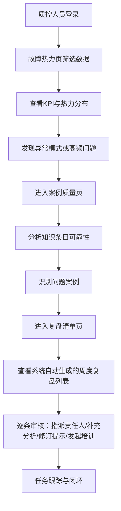

## 1. 产品概述
面向航空公司维修质量部门的数据驱动型航线排故知识库看板系统，通过数据可视化驱动质量改进。

- 核心目标：发现可靠故障经验、识别耗时排故路径、推动知识库持续优化
- 目标用户：质控人员、维修工程师、技术培训人员
- 产品价值：将知识库从被动查询工具转变为主动驱动航线维修改进的质量管控平台

## 2. 核心功能

### 2.1 用户角色
| 角色 | 核心权限 |
|------|----------|
| 质控人员 | 全功能访问，数据筛选，案例质量审核，复盘任务分配 |
| 维修工程师 | 故障热力浏览，案例查看，接收任务提醒 |
| 管理员 | 用户管理，系统配置 |

### 2.2 功能模块
1. **故障热力页**：多维筛选、故障统计、热力图、重复故障分析、常用处理动作
2. **案例质量页**：知识条目引用分析、案例质量检查清单、问题案例识别
3. **复盘清单页**：高频重复故障列表、超时排故记录、任务分配与跟踪

### 2.3 页面详情
| 页面名称 | 模块名称 | 功能描述 |
|-----------|-------------|---------------------|
| 故障热力 | 筛选器 | 按机型、基地、ATA章节、季节、故障代码多维筛选 |
| 故障热力 | KPI卡片 | 显示近3个月故障次数、平均停场时间、重复飞机数、平均处理时长 |
| 故障热力 | 热力图 | ATA章节×月份的故障发生热力矩阵 |
| 故障热力 | 故障排行 | 高频故障列表，展示故障代码、出现次数、平均停场时间 |
| 故障热力 | 重复飞机 | 重复发生故障的飞机注册号、故障次数、ATA章节 |
| 故障热力 | 处理动作 | 常用处理动作统计，动作名称、使用次数、成功率 |
| 案例质量 | 知识引用分析 | 知识条目被引用次数、成功率、风险等级矩阵图 |
| 案例质量 | 问题案例清单 | 缺少手册依据/放行结论/后续跟踪的案例列表 |
| 案例质量 | 质量评分 | 案例质量评分分布，Top/Bottom 10案例展示 |
| 复盘清单 | 周度概览 | 本周复盘范围数据摘要，待处理任务数 |
| 复盘清单 | 高频重复故障 | 自动列出本周高频重复故障，支持指派责任人 |
| 复盘清单 | 超时排故记录 | 超过标准时长的排故记录，支持原因分析录入 |
| 复盘清单 | 任务跟踪 | 待办/进行中/已完成任务列表，支持状态流转 |

## 3. 核心流程

质控人员登录系统后，首先在故障热力页按机型、基地、ATA章节等维度筛选，查看近三个月故障数据分布和关键指标；发现异常模式后进入案例质量页，深入分析知识条目可靠性和案例完整性；每周复盘时，系统自动生成复盘清单，质控人员逐条审核并指派责任工程师补充原因分析、修订排故提示或发起培训提醒，形成闭环改进。

## 4. 用户界面设计

### 4.1 设计风格
- **主色调**：工业蓝 `#1e3a5f` 作为主色，体现航空业专业稳重感；辅助色采用警示橙 `#f59e0b` 和安全绿 `#10b981` 用于状态标识
- **强调色**：深空蓝 `#0f172a` 背景，配合冷白 `#f8fafc` 文本，营造控制台仪表盘氛围
- **字体**：标题使用 JetBrains Mono（等宽字体，数据展示清晰专业），正文使用 IBM Plex Sans（可读性好）
- **视觉风格**：工业数据仪表盘风格，深色主题，数据密集但层次清晰，使用细边框、淡分隔线、栅格背景营造控制台感
- **布局**：顶部导航栏 + 左侧筛选栏 + 主内容卡片网格布局
- **图标**：使用 Lucide 线性图标，统一 20px 尺寸

### 4.2 页面设计概述
| 页面名称 | 模块名称 | UI元素 |
|-----------|-------------|-------------|
| 故障热力 | 筛选器 | 深色下拉选择框，标签式多选项，实时生效按钮组 |
| 故障热力 | KPI卡片 | 渐变边框卡片，大数字显示，趋势箭头，悬停微亮效果 |
| 故障热力 | 热力图 | 颜色梯度映射，单元格悬停显示详细数据，坐标轴标签 |
| 故障热力 | 数据表格 | 斑马行，状态徽章，可排序列头，行悬停高亮 |
| 案例质量 | 引用分析矩阵 | 四象限散点图，坐标轴为引用次数×成功率，气泡大小表示影响范围 |
| 案例质量 | 质量清单 | 三色标签标记缺失项（红/黄/灰），快捷操作按钮 |
| 复盘清单 | 任务卡片 | 待办/进行中/已完成三列看板，可拖拽，责任人头像，优先级徽章 |
| 复盘清单 | 详情弹窗 | 侧边抽屉式，含任务详情、原因分析文本框、操作记录时间线 |

### 4.3 响应式设计
- 桌面端优先（1440px+），支持1920px大屏自适应
- 平板端（768-1024px）筛选栏收起为可展开面板
- 移动端主要用于任务查看和简单审批，表格自动转为卡片列表

### 4.4 动效设计
- 页面加载：卡片依次淡入上滑（staggered fade-in-up）
- 数据更新：数字滚动动画（count-up）
- 交互反馈：按钮按下微缩、卡片悬停轻微上浮发光
- 状态变更：任务卡片在看板列间移动时的平滑过渡动画
