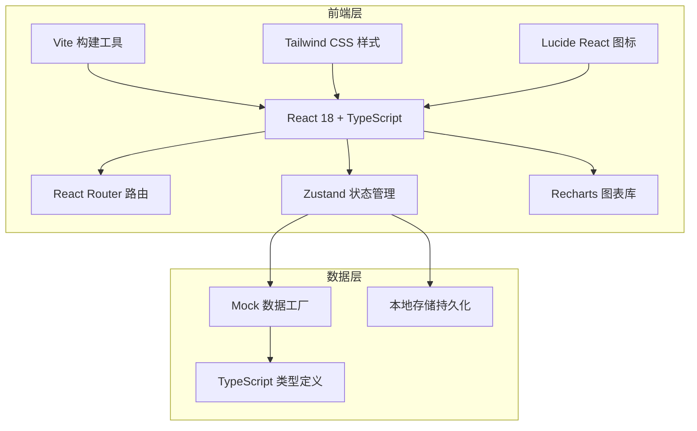
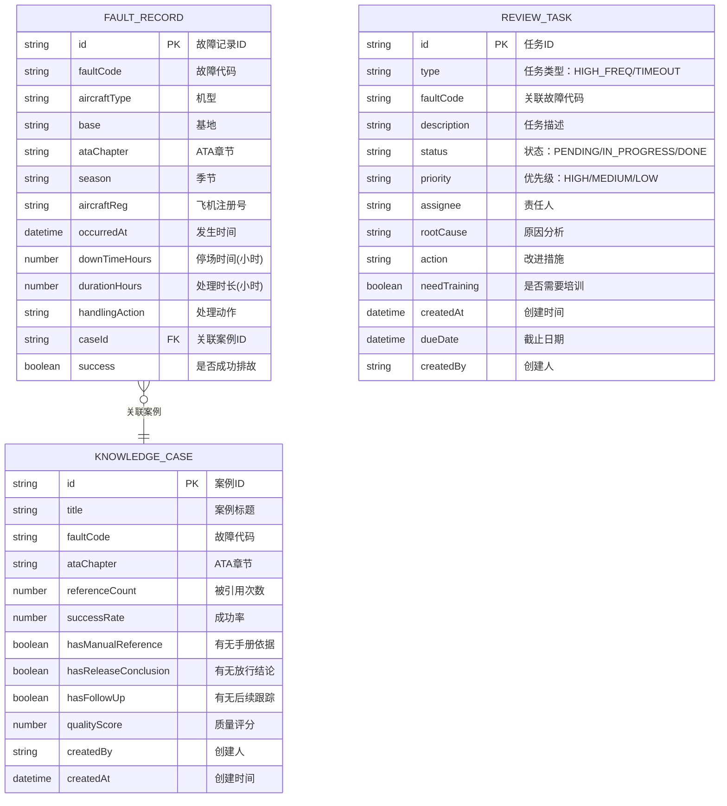

## 1. 架构设计



## 2. 技术说明

- **前端框架**：React@18 + TypeScript + Vite
- **初始化工具**：vite-init（react-ts 模板）
- **路由管理**：react-router-dom@6
- **状态管理**：zustand
- **样式方案**：tailwindcss@3
- **图表可视化**：recharts
- **图标库**：lucide-react
- **后端**：无（纯前端，使用 Mock 数据）
- **数据存储**：localStorage 持久化任务状态

## 3. 路由定义

| 路由 | 页面 | 说明 |
|------|------|------|
| `/` | 故障热力页 | 首页，展示故障热力分析 |
| `/case-quality` | 案例质量页 | 知识条目与案例质量分析 |
| `/review-list` | 复盘清单页 | 周度复盘任务管理 |

## 4. 数据模型

### 4.1 实体关系图



### 4.2 核心类型定义

```typescript
interface FilterState {
  aircraftTypes: string[];
  bases: string[];
  ataChapters: string[];
  seasons: string[];
  faultCodes: string[];
  dateRange: { start: string; end: string };
}

interface FaultRecord {
  id: string;
  faultCode: string;
  faultName: string;
  aircraftType: string;
  base: string;
  ataChapter: string;
  ataName: string;
  season: string;
  aircraftReg: string;
  occurredAt: string;
  downTimeHours: number;
  durationHours: number;
  handlingAction: string;
  caseId?: string;
  success: boolean;
}

interface KnowledgeCase {
  id: string;
  title: string;
  faultCode: string;
  faultName: string;
  ataChapter: string;
  referenceCount: number;
  successCount: number;
  successRate: number;
  hasManualReference: boolean;
  hasReleaseConclusion: boolean;
  hasFollowUp: boolean;
  qualityScore: number;
  createdBy: string;
  createdAt: string;
}

interface ReviewTask {
  id: string;
  type: 'HIGH_FREQ' | 'TIMEOUT';
  faultCode: string;
  faultName: string;
  description: string;
  occurrenceCount?: number;
  overHours?: number;
  status: 'PENDING' | 'IN_PROGRESS' | 'DONE';
  priority: 'HIGH' | 'MEDIUM' | 'LOW';
  assignee?: string;
  rootCause?: string;
  action?: string;
  actionType?: 'ANALYSIS' | 'REVISION' | 'TRAINING';
  needTraining: boolean;
  createdAt: string;
  dueDate: string;
  createdBy: string;
  historyLog: TaskLog[];
}

interface TaskLog {
  timestamp: string;
  action: string;
  operator: string;
  remark?: string;
}

interface HeatmapCell {
  ataChapter: string;
  month: string;
  count: number;
}
```

## 5. 目录结构

```
src/
├── components/
│   ├── layout/
│   │   ├── Header.tsx          # 顶部导航栏
│   │   ├── Sidebar.tsx         # 侧边筛选栏
│   │   └── PageLayout.tsx      # 页面布局容器
│   ├── common/
│   │   ├── KpiCard.tsx         # KPI统计卡片
│   │   ├── DataTable.tsx       # 通用数据表格
│   │   ├── FilterPanel.tsx     # 筛选面板
│   │   ├── StatusBadge.tsx     # 状态徽章
│   │   └── PriorityBadge.tsx   # 优先级徽章
│   ├── heatmap/
│   │   ├── FaultHeatmap.tsx    # 故障热力图
│   │   ├── FaultRankList.tsx   # 故障排行列表
│   │   ├── RepeatAircraft.tsx  # 重复故障飞机
│   │   └── ActionStats.tsx     # 处理动作统计
│   ├── quality/
│   │   ├── ReferenceMatrix.tsx # 引用分析矩阵
│   │   ├── IssueCaseList.tsx   # 问题案例清单
│   │   └── QualityScore.tsx    # 质量评分分布
│   └── review/
│       ├── WeekOverview.tsx    # 周度概览
│       ├── HighFreqFaults.tsx  # 高频故障列表
│       ├── TimeoutRecords.tsx  # 超时排故记录
│       ├── TaskBoard.tsx       # 任务看板
│       └── TaskDrawer.tsx      # 任务详情抽屉
├── pages/
│   ├── FaultHeatmapPage.tsx    # 故障热力页
│   ├── CaseQualityPage.tsx     # 案例质量页
│   └── ReviewListPage.tsx      # 复盘清单页
├── hooks/
│   ├── useFilter.ts            # 筛选逻辑Hook
│   └── useReviewTasks.ts       # 复盘任务Hook
├── store/
│   ├── filterStore.ts          # 筛选状态
│   └── reviewStore.ts          # 复盘任务状态
├── types/
│   └── index.ts                # 全局类型定义
├── utils/
│   ├── mock.ts                 # Mock数据生成
│   └── helpers.ts              # 工具函数
├── App.tsx
├── main.tsx
└── index.css
```

## 6. 状态管理设计

### Filter Store（筛选状态）
- 存储当前筛选条件（机型、基地、ATA章节、季节、故障代码、时间范围）
- 提供设置/重置方法
- 故障热力页和案例质量页共享

### Review Store（复盘任务状态）
- 存储复盘任务列表
- 提供任务CRUD操作（创建、分配、更新状态、添加备注）
- 持久化到 localStorage
